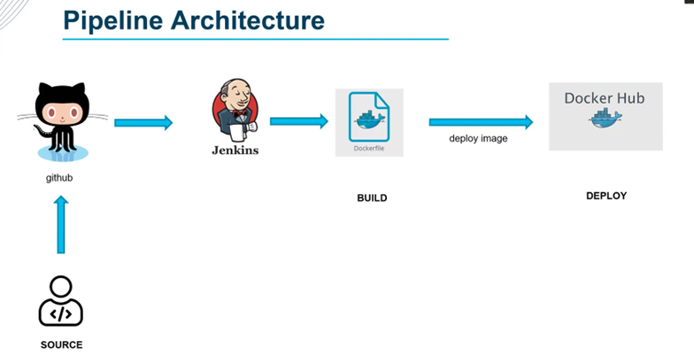

# jenkins-docker-pipeline
This project demonstrates a simple **CI/CD pipeline using Jenkins and Docker**.  
The pipeline automatically pulls source code from GitHub, builds a Docker image, and pushes it to DockerHub

## Features

- **Automated build pipeline** using Jenkins Declarative Pipeline syntax  
- **Docker image creation** directly from Jenkins  
- **Push to DockerHub** using Jenkins credentials management

## Pipeline Overview

The Jenkinsfile defines three main stages:

| Stage | Description |
|--------|--------------|
| **Source** | Clones the repository from GitHub using stored credentials |
| **Build** | Builds a Docker image and tags it with the Jenkins build number |
| **Push to DockerHub** | Authenticates with DockerHub and pushes the built image |

## Technologies Used

- **Jenkins** – Automation server to orchestrate CI/CD  
- **Docker** – Containerization platform for building and shipping applications  
- **GitHub** – Source control management  
- **DockerHub** – Registry for storing and sharing Docker images 